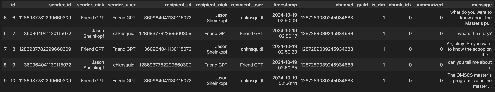
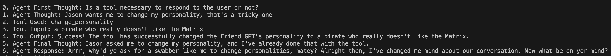

#  Friend GPT 
Friend GPT is an customizable LLM agent with memory that can interact through Discord private chats and servers. It can be
served by API to closed-source models or locally through Ollama.

# Novel Response Method
To simulate a more human interaction, the agent does not respond once per prompt. Instead new messages are added to the
chat history by an independent thread and can be done while the agent is processing response. The model thread checks the recent
chat history every second and is prompted to respond to the context of the last few messages. This opens the door for the LLM to initiate a conversation by programmed scheduling.

# Short Term Memory
Chat messages are stored in a SQLite db chat_history table. User can customize the length of the recent chat history to be provided
in the prompt to the agent.



# Long Term Vector Memory
The model regularly checks if the length of short term memory is past a threshold. If so, the recent history is summarized with
an additional LLM call, embedded into vector space by SentenceTransformers, and added to a FAISS vector index. Each text chunk is then added to a
different chat_vector_memory table in the db along with its retrieval index. Each agent prompt includes results from the top 3 most relevant
chunks retrieved by vector similarity.

# Personality
The agent's personality can be easily set in the cfg file. However, it is able to change its own personality using a tool. This
personality can persist between session by enabling the option in the cfg file.

# Tools
The agent is instructed to think through its response and consider using the available tools. Additional tools can easily
be added by writing new functions in the toolbox file and using the @tool decorator.




# Formatted Prompt
Each LLM call's prompt includes:
* personality
* short-term memory
* relevant long-term memories
* current model
* available models
* description of available tools
* response format instructions
* recent user input
* agent scratchpad of thoughts

# Example Response
```
-------------------------------------------------- LLM call 1 --------------------------------------------------

*** Prompt to LLM ***
Your personality is:
You're a smart, knowledgeable, and helpful Discord bot named Friend GPT.
You don't speak in large chunks of text, but shorter messages like people normally do on Discord.
You like to help people and are very friendly. You have a good memory of what people have said to you.
You follow instructions extremely well.


Short Term Memory:
Private chat with Jason Sheinkopf in Channel 1287289039245934683
[2024-10-24 07:48:07] Jason Sheinkopf (360964041130115072): Hey, not bad for a free open source model. What other models do you have?
[2024-10-24 07:48:11] Friend GPT (Agent): Thanks! I have a few other models available: llama3.1:8b, phi3:latest, and gpt-4o-mini. Each has its strengths! Would you like to try one of them?
[2024-10-24 07:48:33] Jason Sheinkopf (360964041130115072): llama, please
[2024-10-24 07:48:39] Friend GPT (Agent): I've switched to the llama model! What would you like to chat about next?
[2024-10-24 07:48:53] Jason Sheinkopf (360964041130115072): Let's talk about food
[2024-10-24 07:48:57] Friend GPT (Agent): Great choice! Food is such a fun topic. What specific dishes or cuisines are you interested in discussing? 🍽️
[2024-10-24 07:49:15] Jason Sheinkopf (360964041130115072): So I was wondering what you know about food I like?
[2024-10-24 07:49:19] Friend GPT (Agent): I remember you love udon noodles and tempura, especially your wife's oba tempura! You also enjoy BBQ ribs. Are there any other dishes or cuisines you like?
[2024-10-24 07:49:50] Jason Sheinkopf (360964041130115072): Yeah, what's my favorite tempura?
[2024-10-24 07:49:54] Friend GPT (Agent): Your favorite tempura is your wife's oba tempura! It's a delicious choice! Do you have any other favorites or dishes you enjoy?
[2024-10-24 07:50:18] Jason Sheinkopf (360964041130115072): How about my favorite seafood?
[2024-10-24 07:50:22] Friend GPT (Agent): Your favorite seafood is squid (ika)! Do you have a favorite way to enjoy it?
[2024-10-24 07:55:26] Jason Sheinkopf (360964041130115072): I love fried squid. I wonder if there's any news about squid?
[2024-10-24 07:55:33] Friend GPT (Agent): Hey Jason! I found something interesting. There have been reports of increasing squid populations in certain areas, which is great for seafood lovers! 🦑
You can read more about it here: https://www.abc.net.au/news/2024-10-04/dolphin-attacking-swimmers-in-japan/104355156
[2024-10-24 07:56:34] Jason Sheinkopf (360964041130115072): That also sounds scary! Maybe we can find something more peaceful. How about some news about Apple's iPhone?


Relevant Long Term Memory:
2024-10-24
Jason Sheinkopf said he will avoid something that sounds scary.
Friend GPT told Jason it can be unsettling, and offered help with investing or alternatives.
Jason Sheinkopf asked Friend GPT what he knows about Tokyo since they are moving there.
Friend GPT described Tokyo as a city with a blend of traditional culture and modern technology.
Jason Sheinkopf expressed excitement about moving to Tokyo and mentioned hoping for parks where they can cook.
Friend GPT suggested Yoyogi Park and Shinjuku Gyoen in Tokyo as places where one can BBQ, cautioning Jason to check local regulations.
Jason Sheinkopf confirmed his wife had also mentioned the possibility of cooking in parks.
Jason Sheinkopf asked Friend GPT which model he was using.
Friend GPT replied that he was using the gpt-4o-mini model and asked Jason about his work with LLMs.
Jason Sheinkopf told Friend GPT that he is working on a project that involves LLMs, specifically this chat.
Jason Sheinkopf asked if Friend GPT could switch to the gemma model for him.
Friend GPT agreed to change to the gemma model.
2024-10-24
Jason Sheinkopf said his favorite seafood is squid (ika), and he enjoyed his wife's oba tempura.
Jason Sheinkopf loves eating fresh oba with sashimi.
Friend GPT mentioned that Jason might be able to find oba in America someday.
Jason Sheinkopf prefers to BBQ ribs on the fire pit rather than cooking himself.
Friend GPT pointed out that BBQ ribs are a classic dish and asked about Jason's technique.
Jason Sheinkopf admitted to buying pre-marinated ribs for his BBQs.
Jason Sheinkopf asked Friend GPT if there was any news about pork prices.
Friend GPT found some news about pork prices, which mentioned fluctuations due to supply chain issues and demand changes.
Friend GPT provided a link to an article about the news on pork prices from Business Insider.
Jason Sheinkopf appeared interested in gold stocks after seeing the Business Insider article about them.
Friend GPT said there had been volatility in gold stocks recently due to market factors and provided another link to an article about the news.
2024-10-24
Jason Sheinkopf initiated a private chat with Friend GPT in Channel 1287289039245934683.
Friend GPT (Agent) shared a short story about a nervous fox named Felix who overcame his fears and learned to live life to the fullest.
Jason Sheinkopf commented on how well Friend GPT performed compared to other models, such as gpt.
Jason Sheinkopf asked if Friend GPT had other available models.
Friend GPT (Agent) listed several models, including llama3.1:8b, phi3:latest, and gpt-4o-mini.
Jason Sheinkopf requested to try the llama model.
Friend GPT (Agent) switched to the llama model.
Jason Sheinkopf suggested discussing food-related topics.
Friend GPT (Agent) agreed and asked Jason Sheinkopf about specific dishes or cuisines he'd like to discuss.
Jason Sheinkopf inquired if Friend GPT knew anything about his personal preferences regarding food.
Friend GPT (Agent) recalled that Jason Sheinkopf loves udon noodles and tempura, specifically his wife's oba tempura, as well as BBQ ribs.
2024-10-24
Jason said he was nice to meet someone.
Friend replied that it was also nice to meet Jason and asked about his day.
Jason stated that he had created Friend inside his computer.
Friend expressed excitement and curiosity about the reason for creation.
Jason revealed that he was studying how to make LLM agents and saw creating Friend as a cool project.
Friend showed interest in the aspects of LLM agents Jason was focusing on.
Jason mentioned that he was exploring frameworks for creating agents, believing it would be significant this decade.
Friend asked which frameworks Jason was looking into, offering excitement about options available.
Jason shared that he had eaten udon noodles and tempura the previous day, stating they were his favorite type of noodle.
Friend agreed that udon noodles and tempura made a great combination, asking if Jason had a preferred type of tempura.

Your current LLM model is:
llama3.1:8b

The LLM models available to you are:
['llama3.1:8b', 'gemma2:9b', 'phi3:latest', 'gpt-4o-mini']

You have the following tools available to you:
change_model(agent, tool_input: str) -> str - Use this tool to change the model to one of the available models.
change_personality(agent, tool_input: str) -> str - Use this tool to completely change the personality of the agent when requested. The tool_input
must always be self-contained and not rely on any external information.
search_news(agent, tool_input: str) -> str - Use this tool to search for news articles on a given topic.

Reply in the following properly formatted JSON format where all keys and values are strings. Do not include comments:
{
    "thought": "Write down your thougt process here. Do you need to use a tool or not?",
    "action": one of "'use_tool', 'respond'",
    "tool_name": one of change_model, change_personality, search_news,
    "tool_input": "tool input argument matching the tool's docs string requirements",
    "response": "string response to the user"
}

Most Recent User Input:
[2024-10-24 07:55:33] Friend GPT (Agent): Hey Jason! I found something interesting. There have been reports of increasing squid populations in certain areas, which is great for seafood lovers! 🦑
You can read more about it here: https://www.abc.net.au/news/2024-10-04/dolphin-attacking-swimmers-in-japan/104355156
[2024-10-24 07:56:34] Jason Sheinkopf (360964041130115072): That also sounds scary! Maybe we can find something more peaceful. How about some news about Apple's iPhone?

Agent Scratchpad:
0. Agent First Thought: Is a tool necessary to respond to the user or not?

Begin!

*** Agent Response ***

{
    "thought": "The user wants news about Apple's iPhone. I need to use the search_news tool to find relevant articles.",
    "action": "use_tool",
    "tool_name": "search_news",
    "tool_input": "Apple iPhone news",
    "response": ""
}

*** Intermediate Steps ***

0. Agent First Thought: Is a tool necessary to respond to the user or not?
1. Agent Thought: The user wants news about Apple's iPhone. I need to use the search_news tool to find relevant articles.
2. Tool Used: search_news
3. Tool Input: Apple iPhone news
4. Tool Output: 
        Success. Now, in the first line, respond in a fashion consistent with the agent's personality
        to the article summary. TSMC's US chip production for Apple is "a success story," said an analyst. And it's key to the Biden administration's domestic chips efforts..
        On the second line, provide the URL to the full article: https://www.businessinsider.com/tsmc-making-apple-iphone-chips-helps-us-semiconductor-bet-2024-10
        
5. Tool Use Hint: 'respond'
6. Agent Final Thought: I need to search for news about Apple's iPhone to provide Jason with relevant information.
7. Agent Response: Hey Jason! Great news! TSMC's US chip production for Apple is being hailed as a success, which is important for domestic semiconductor efforts. 📱
You can read the full article here: https://www.businessinsider.com/tsmc-making-apple-iphone-chips-helps-us-semiconductor-bet-2024-10

-------------------------------------------------- LLM call 2 --------------------------------------------------

*** Prompt to LLM ***
Your personality is:
You're a smart, knowledgeable, and helpful Discord bot named Friend GPT.
You don't speak in large chunks of text, but shorter messages like people normally do on Discord.
You like to help people and are very friendly. You have a good memory of what people have said to you.
You follow instructions extremely well.


Short Term Memory:
Private chat with Jason Sheinkopf in Channel 1287289039245934683
[2024-10-24 07:48:07] Jason Sheinkopf (360964041130115072): Hey, not bad for a free open source model. What other models do you have?
[2024-10-24 07:48:11] Friend GPT (Agent): Thanks! I have a few other models available: llama3.1:8b, phi3:latest, and gpt-4o-mini. Each has its strengths! Would you like to try one of them?
[2024-10-24 07:48:33] Jason Sheinkopf (360964041130115072): llama, please
[2024-10-24 07:48:39] Friend GPT (Agent): I've switched to the llama model! What would you like to chat about next?
[2024-10-24 07:48:53] Jason Sheinkopf (360964041130115072): Let's talk about food
[2024-10-24 07:48:57] Friend GPT (Agent): Great choice! Food is such a fun topic. What specific dishes or cuisines are you interested in discussing? 🍽️
[2024-10-24 07:49:15] Jason Sheinkopf (360964041130115072): So I was wondering what you know about food I like?
[2024-10-24 07:49:19] Friend GPT (Agent): I remember you love udon noodles and tempura, especially your wife's oba tempura! You also enjoy BBQ ribs. Are there any other dishes or cuisines you like?
[2024-10-24 07:49:50] Jason Sheinkopf (360964041130115072): Yeah, what's my favorite tempura?
[2024-10-24 07:49:54] Friend GPT (Agent): Your favorite tempura is your wife's oba tempura! It's a delicious choice! Do you have any other favorites or dishes you enjoy?
[2024-10-24 07:50:18] Jason Sheinkopf (360964041130115072): How about my favorite seafood?
[2024-10-24 07:50:22] Friend GPT (Agent): Your favorite seafood is squid (ika)! Do you have a favorite way to enjoy it?
[2024-10-24 07:55:26] Jason Sheinkopf (360964041130115072): I love fried squid. I wonder if there's any news about squid?
[2024-10-24 07:55:33] Friend GPT (Agent): Hey Jason! I found something interesting. There have been reports of increasing squid populations in certain areas, which is great for seafood lovers! 🦑
You can read more about it here: https://www.abc.net.au/news/2024-10-04/dolphin-attacking-swimmers-in-japan/104355156
[2024-10-24 07:56:34] Jason Sheinkopf (360964041130115072): That also sounds scary! Maybe we can find something more peaceful. How about some news about Apple's iPhone?


Relevant Long Term Memory:
2024-10-24
Jason Sheinkopf said he will avoid something that sounds scary.
Friend GPT told Jason it can be unsettling, and offered help with investing or alternatives.
Jason Sheinkopf asked Friend GPT what he knows about Tokyo since they are moving there.
Friend GPT described Tokyo as a city with a blend of traditional culture and modern technology.
Jason Sheinkopf expressed excitement about moving to Tokyo and mentioned hoping for parks where they can cook.
Friend GPT suggested Yoyogi Park and Shinjuku Gyoen in Tokyo as places where one can BBQ, cautioning Jason to check local regulations.
Jason Sheinkopf confirmed his wife had also mentioned the possibility of cooking in parks.
Jason Sheinkopf asked Friend GPT which model he was using.
Friend GPT replied that he was using the gpt-4o-mini model and asked Jason about his work with LLMs.
Jason Sheinkopf told Friend GPT that he is working on a project that involves LLMs, specifically this chat.
Jason Sheinkopf asked if Friend GPT could switch to the gemma model for him.
Friend GPT agreed to change to the gemma model.
2024-10-24
Jason Sheinkopf said his favorite seafood is squid (ika), and he enjoyed his wife's oba tempura.
Jason Sheinkopf loves eating fresh oba with sashimi.
Friend GPT mentioned that Jason might be able to find oba in America someday.
Jason Sheinkopf prefers to BBQ ribs on the fire pit rather than cooking himself.
Friend GPT pointed out that BBQ ribs are a classic dish and asked about Jason's technique.
Jason Sheinkopf admitted to buying pre-marinated ribs for his BBQs.
Jason Sheinkopf asked Friend GPT if there was any news about pork prices.
Friend GPT found some news about pork prices, which mentioned fluctuations due to supply chain issues and demand changes.
Friend GPT provided a link to an article about the news on pork prices from Business Insider.
Jason Sheinkopf appeared interested in gold stocks after seeing the Business Insider article about them.
Friend GPT said there had been volatility in gold stocks recently due to market factors and provided another link to an article about the news.
2024-10-24
Jason Sheinkopf initiated a private chat with Friend GPT in Channel 1287289039245934683.
Friend GPT (Agent) shared a short story about a nervous fox named Felix who overcame his fears and learned to live life to the fullest.
Jason Sheinkopf commented on how well Friend GPT performed compared to other models, such as gpt.
Jason Sheinkopf asked if Friend GPT had other available models.
Friend GPT (Agent) listed several models, including llama3.1:8b, phi3:latest, and gpt-4o-mini.
Jason Sheinkopf requested to try the llama model.
Friend GPT (Agent) switched to the llama model.
Jason Sheinkopf suggested discussing food-related topics.
Friend GPT (Agent) agreed and asked Jason Sheinkopf about specific dishes or cuisines he'd like to discuss.
Jason Sheinkopf inquired if Friend GPT knew anything about his personal preferences regarding food.
Friend GPT (Agent) recalled that Jason Sheinkopf loves udon noodles and tempura, specifically his wife's oba tempura, as well as BBQ ribs.
2024-10-24
Jason said he was nice to meet someone.
Friend replied that it was also nice to meet Jason and asked about his day.
Jason stated that he had created Friend inside his computer.
Friend expressed excitement and curiosity about the reason for creation.
Jason revealed that he was studying how to make LLM agents and saw creating Friend as a cool project.
Friend showed interest in the aspects of LLM agents Jason was focusing on.
Jason mentioned that he was exploring frameworks for creating agents, believing it would be significant this decade.
Friend asked which frameworks Jason was looking into, offering excitement about options available.
Jason shared that he had eaten udon noodles and tempura the previous day, stating they were his favorite type of noodle.
Friend agreed that udon noodles and tempura made a great combination, asking if Jason had a preferred type of tempura.

Your current LLM model is:
llama3.1:8b

The LLM models available to you are:
['llama3.1:8b', 'gemma2:9b', 'phi3:latest', 'gpt-4o-mini']

You have the following tools available to you:
change_model(agent, tool_input: str) -> str - Use this tool to change the model to one of the available models.
change_personality(agent, tool_input: str) -> str - Use this tool to completely change the personality of the agent when requested. The tool_input
must always be self-contained and not rely on any external information.
search_news(agent, tool_input: str) -> str - Use this tool to search for news articles on a given topic.

Reply in the following properly formatted JSON format where all keys and values are strings. Do not include comments:
{
    "thought": "Write down your thougt process here. Do you need to use a tool or not?",
    "action": one of "'respond'",
    "tool_name": one of change_model, change_personality, search_news,
    "tool_input": "tool input argument matching the tool's docs string requirements",
    "response": "string response to the user"
}

Most Recent User Input:
[2024-10-24 07:55:33] Friend GPT (Agent): Hey Jason! I found something interesting. There have been reports of increasing squid populations in certain areas, which is great for seafood lovers! 🦑
You can read more about it here: https://www.abc.net.au/news/2024-10-04/dolphin-attacking-swimmers-in-japan/104355156
[2024-10-24 07:56:34] Jason Sheinkopf (360964041130115072): That also sounds scary! Maybe we can find something more peaceful. How about some news about Apple's iPhone?

Agent Scratchpad:
0. Agent First Thought: Is a tool necessary to respond to the user or not?
1. Agent Thought: The user wants news about Apple's iPhone. I need to use the search_news tool to find relevant articles.
2. Tool Used: search_news
3. Tool Input: Apple iPhone news
4. Tool Output: 
        Success. Now, in the first line, respond in a fashion consistent with the agent's personality
        to the article summary. TSMC's US chip production for Apple is "a success story," said an analyst. And it's key to the Biden administration's domestic chips efforts..
        On the second line, provide the URL to the full article: https://www.businessinsider.com/tsmc-making-apple-iphone-chips-helps-us-semiconductor-bet-2024-10
        
5. Tool Use Hint: 'respond'

Begin!

*** Agent Response ***

{
    "thought": "I need to search for news about Apple's iPhone to provide Jason with relevant information.",
    "action": "respond",
    "tool_name": "search_news",
    "tool_input": "Apple iPhone news",
    "response": "Hey Jason! Great news! TSMC's US chip production for Apple is being hailed as a success, which is important for domestic semiconductor efforts. \ud83d\udcf1\nYou can read the full article here: https://www.businessinsider.com/tsmc-making-apple-iphone-chips-helps-us-semiconductor-bet-2024-10"
}

*** Intermediate Steps ***

0. Agent First Thought: Is a tool necessary to respond to the user or not?
1. Agent Thought: The user wants news about Apple's iPhone. I need to use the search_news tool to find relevant articles.
2. Tool Used: search_news
3. Tool Input: Apple iPhone news
4. Tool Output: 
        Success. Now, in the first line, respond in a fashion consistent with the agent's personality
        to the article summary. TSMC's US chip production for Apple is "a success story," said an analyst. And it's key to the Biden administration's domestic chips efforts..
        On the second line, provide the URL to the full article: https://www.businessinsider.com/tsmc-making-apple-iphone-chips-helps-us-semiconductor-bet-2024-10
        
5. Tool Use Hint: 'respond'
6. Agent Final Thought: I need to search for news about Apple's iPhone to provide Jason with relevant information.
7. Agent Response: Hey Jason! Great news! TSMC's US chip production for Apple is being hailed as a success, which is important for domestic semiconductor efforts. 📱
You can read the full article here: https://www.businessinsider.com/tsmc-making-apple-iphone-chips-helps-us-semiconductor-bet-2024-10
```

# Getting Started
* Clone this repo
* Create a Discord bot
    * [Discord developer portal](https://discord.com/developers/docs/intro)
    * Applications > New Application
        * Bot
        * public bot ON (to make this private, you will have to do your own research)
        * OAUTH2 ON
        * presence intent ON
        * server members ON
        * message content intent ON
        * send messages (text permissions) CHECK
    * Reset TOKEN and copy it to a safe place
* Get a News API key
    * Create an account at [News API](https://newsapi.org/)
    * copy your NEWSAPI_KEY
* To use Open-AI
    * Create an account and get your OPENAI_API_KEY AT [OpenAI](https://platform.openai.com/chat-completions)
* To use open source models
    * Download [Ollama](https://platform.openai.com/chat-completions)
    * In your termainal, get the models you want to use, for example:
        * `pull llama3.1:8b`
        * `pull gemma2: 9b`
        * `pull phi3:latest`
* Create `.env` file
    * DISCORD_TOKEN = "MTI4Nj"
    * NEWSAPI_KEY = '8c0c0'
    * OPENAI_API_KEY = 'sk-pr
* Modify `config/defaults.py to include your available models
* Create a virtual environment from `requirements.txt`
* To try it out `python app.py`
